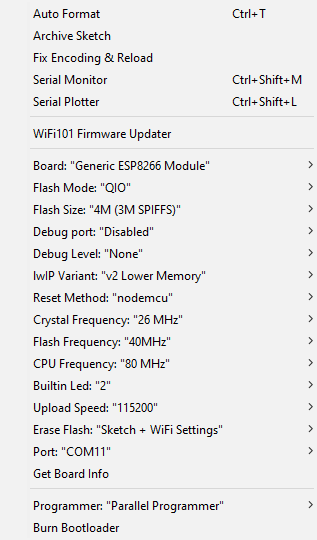

# Crowd-Sensing
A Crowd Sensor using ESP8266 NodeMCU and Arduino IDE

## Main Achievements
1. A probe request counter for crowd sensing using ESP8266;
2. Firebase integration;
3. MQTT integration (the default one);
4. Struct to JSON, being then the JsonObject sent to Firebase or MQTT;
5. Timers and newSightings detection functions;
6. Interaction with Serial Monitor via commands.

## Setup Notes
Just open the sketch on Arduino IDE and, <i>optionally</i>, redefine some variables:
- <i>useMqtt</i> variable defines the use of MQTT broker (true value - <b>the default</b>) or Firebase (false value)
- <i>FIREBASE_HOST</i>, <i>FIREBASE_AUTH</i> and <i>FIREBASE_PUSH</i> (Firebase setup - it will still print probes if no setup is made for Firebase)
- <i>MQTTSERVER</i>, <i>MQTTPORT</i>, <i>MQTTUSER</i> and <i>MQTTPASSWORD</i>
- STATION_NETWORK and STATION_PASSWORD (WiFi credentials - if not defined the board will only work as an AP)

Then, on the Tools tab define the correct options (baud, board, port, ...) and upload the sketch to the board. You should use an upload speed of, at least, 57600 otherwise strange timeouts will occur when uploading the sketch!  

  

<b>Additional Notes:</b>
- You will need to install, on Arduino IDE, <i>FirebaseArduino</i> and <i>PubSubClient</i> libs
- PubSubClient <i>publish()</i> works with a QoS of 0: there are no guarantees data will reach the broker
- the <i>PubSubClient</i> library limits the payload to 128 bytes on the <i>MQTT_MAX_PACKET_SIZE</i> variable. As we may sense several devices, the JSON may get quite big and this space will prevent the payload from being sent to the MQTT broker! You must navigate to <i>..\libraries\PubSubClient\src</i>, open the file entitled as <i>PubSubClient.h</i> and increase the <i>MQTT_MAX_PACKET_SIZE</i> value (I've changed it 4096)
- If WiFi is available then the timer will start automatically and will wake up all <i>sendTimer</i> seconds
- As MQTT broker you can use <i>CloudMQTT</i> (they have a free plan) and as client you can use, for example, <i>HiveMQ</i> or even <i>CloudMQTT</i>

## Available Commands
You may open the Serial Monitor to visualize detailed information. 
It also accepts the following commands:
- <b>Stop</b> - stops the handlers that capture the data
- <b>Restart</b> - restarts the handlers if they have been stopped
- <b>Count</b> - prints the number of distinct detected devices
- <b>Print</b> - prints the entire list of detected devices
- <b>Clear</b> - clears the entire list of detected devices
- <b>Send</b> - sends the list of detected devices in JSON to the specified Firebase database
- <b>Start Timer</b> - starts a timer that sends the list of detected devices every <i>sendTimer</i> seconds (default: 45s), in JSON, to the specified Firebase database
- <b>Stop Timer</b> - stops the timer
